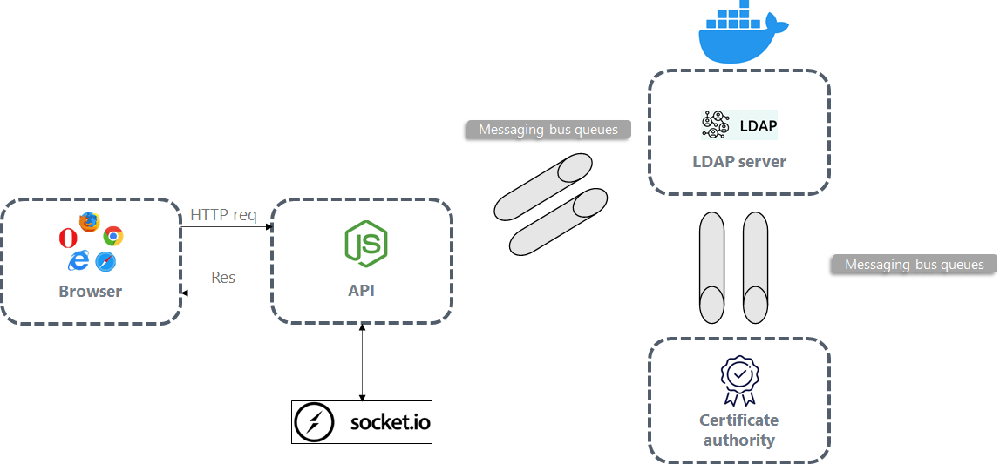
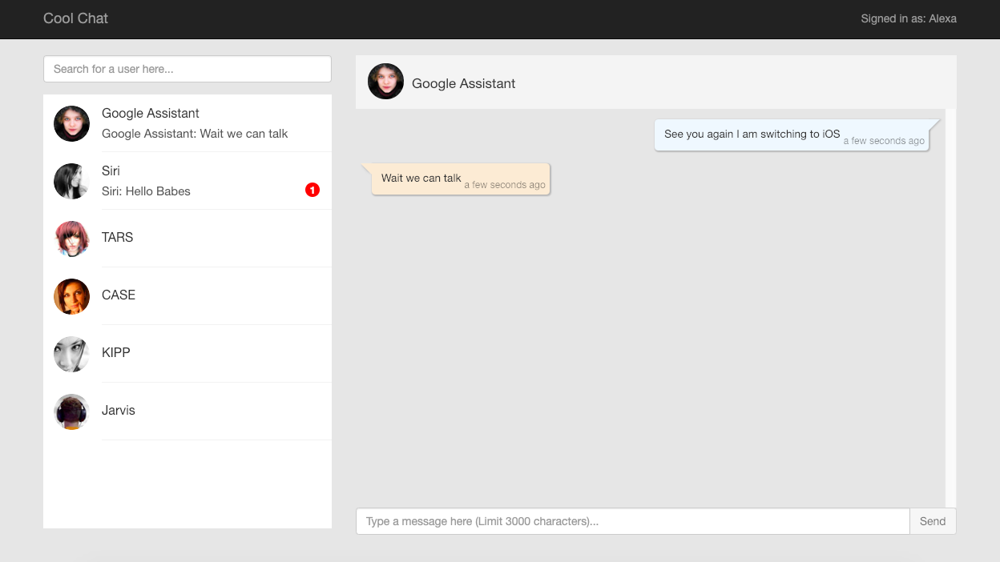

# Secured chat app

## Technologies used

- Ldap3 and cryptography for python 3
- Reactjs for the frontend
- Nodejs for the api
- RabbitMQ as a messaging bus
- Docker to easly launch Ldap server and rabbitMQ server
- Socket.io for real time messaging

## Installation
For the frontend

```sh
npm i 
npm start
```

For the api

```sh
npm i 
npm start
```
For the python project

```sh
pipenv shell
pip install
```
Run RabbitMQ server

```sh
docker run -it --rm --name rabbitmq -p 5672:5672 -p 15672:15672 rabbitmq:3-management
```

Run LDAP server

```sh
docker run -p 389:389 --name ldap-service --hostname ldap-service --env LDAP_ORGANISATION="INSAT" --env LDAP_DOMAIN="insat.com" \
--env LDAP_ADMIN_PASSWORD="adminPassword" --env LDAP_BASE_DN="dc=insat,dc=com" --volume /data/slapd/database:/var/lib/ldap \
--volume /data/slapd/config:/etc/ldap/slapd.d --detach osixia/openldap:1.3.0
```

Run phpLDAPadmin as a UI to manage the LDAP server

```sh
docker run --name phpldapadmin-service --hostname phpldapadmin-service --link ldap-service:ldap-host --env PHPLDAPADMIN_LDAP_HOSTS=ldap-service --detach osixia/phpldapadmin:0.9.0
```

Get phpLDAPadmin's IP adress in order to access the UI

```sh
docker inspect -f "{{ .NetworkSettings.IPAddress }}" phpldapadmin-service
```
## Global Architecture

Our solution final architecture should look like this:


## Frontend design



## Current state

- Real time messaging
- No encryption or decryption
- Ldap stores users
- CA sign new certificates
- LDAP logic and CA logic are presented in one file for development simplicity purpose
 

## Goal state

- Separation of concerns: LDAP server and CA server must be presented by different servers 
- Encryption and decryption using a certificate in order to be able to encrypt large files 
- before each communication a user should send his target's certificate to CA in order to verify it
- use RPC model for rabbitMQ to link different elements via message events

